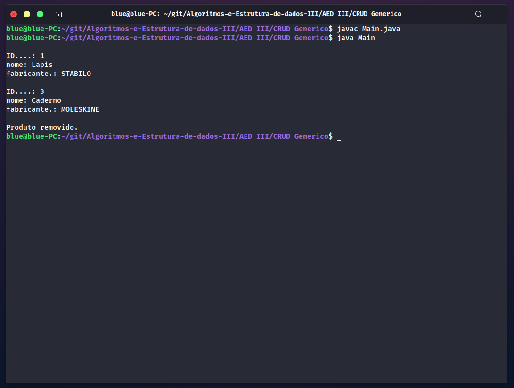

# 1. AED III Relátorio - Desafio individual 1 - CRUD Genérico

## 1.1 Funcionalidades

As seguintes funcionalidades foram implementadas:

[x] - Create

[x] - Read

[ ] - Update

[x] - Delete

## 1.2 Problemas de implementação

Tive muita dificuldade com o metodo de update tentei fazer de duas maneiras e ambos os o códigos esta me retornaram `java.io.EOFException`, o erro é retornado apenas quando faço o update e logo em seguida tento ler algum registro. Não consegui identificar os motivos. 

### 1.2.1 Código update2:
```java
public boolean update2(T objeto) throws Exception{
    
    if(!delete(objeto.getID())) return false;        
    T status = createUpdate(objeto);
    return status == null ? false:true;
}

private T createUpdate(T objeto) throws Exception {
    
    byte[] tba = objeto.toByteArray();

    this.arquivo = new RandomAccessFile(this.nArquivo, "rw");        

    arquivo.seek(this.arquivo.length());          

    this.arquivo.writeBoolean(true);
    this.arquivo.writeInt(tba.length);
    this.arquivo.write(tba);
    
    this.arquivo.close();        

    return objeto;
}
```


Os metodos create, read e delete estão funcionando.




# 2. Implementação

* Rayane Paiva - :email: rayanepaiiva@live.com


# 3. Licença

The [MIT License](https://pt.wikipedia.org/wiki/Licen%C3%A7a_MIT) (MIT)

Copyright :copyright: 2021 - Algoritmos e Estruturas de Dados III